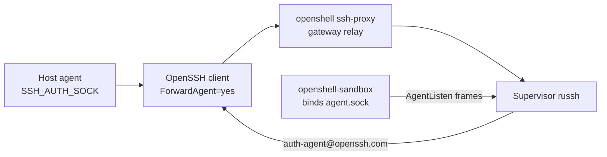

`--forward-agent` is opt-in. A sandbox with a live agent can list keys, sign, and push as the host user. A security-key certificate still asks for a tap on the host.

This page describes the implementation on `harry-anderson/OpenShell`, branch `feat/ssh-agent-forward-upstream`. `smartcontractkit/openshell` does not implement the forward. Its `swe/` launchers pass the flag, and they keep an older host TCP relay for the case where the flag is off.

The host agent socket stays on the laptop. Create overwrites `SSH_AUTH_SOCK` with a pinned path inside the sandbox. Agent-protocol bytes ride the existing authenticated SSH session through the gateway relay. Docker, Podman, VM, and Kubernetes use that same path.

## Path

The forward is one SSH session. The host agent never moves. Each accept on the sandbox socket is bridged back to that session.



1. The laptop agent is already running. PassportControl, `ssh-agent`, or 1Password is fine. Create and connect check that `SSH_AUTH_SOCK` is set and the path exists.
2. The CLI opens an SSH session with `ForwardAgent=yes` and `IdentityAgent=SSH_AUTH_SOCK`. `IdentityAgent` is that token, not the raw path. PassportControl sockets live under a directory whose name contains spaces, and OpenSSH parses `-o` values as `ssh_config` lines.
3. `ProxyCommand` is `openshell ssh-proxy`. That is the same authenticated gateway relay `sandbox connect` uses. The client does not dial the sandbox pod or the Docker bridge.
4. The supervisor SSH server receives `auth-agent-req@openssh.com`. The first request on that server asks the workload to bind the socket (`Request::AgentListen` on the boundary channel).
5. `openshell-sandbox`, inside the workload mount namespace, binds `/tmp/openshell-ssh-agent/agent.sock` and multiplexes each accept back to the supervisor. The two processes do not share a mount namespace, so the supervisor cannot bind this socket itself. An earlier revision of this fork did bind it in the supervisor. That only worked while the two processes shared a mount.
6. For each accept, the supervisor opens `auth-agent@openssh.com` toward the client. OpenSSH on the laptop talks to the host agent. The private key stays there.

The mux frame is 9 bytes plus a payload: kind, connection id, length. Kinds are open, data, and close. Payloads are capped at 256 KiB.

The CLI sets `ForwardAgent=no` on every other SSH command, including exec, port forwards, and the readiness probe. A `ForwardAgent yes` line in `~/.ssh/config` does not override that.

## Why the keepalive is a session

OpenSSH sends `auth-agent-req@openssh.com` on a session channel. `ssh -N` has no session channel, so it never forwards the agent, even with `ForwardAgent=yes`. Port forwards use `-N` and force `ForwardAgent=no`.

The background keepalive is a real session:

```text
ssh -f -T -o RequestTTY=no sandbox sleep infinity
```

with `ForwardAgent=yes`. The CLI records its PID under the forwards directory as `{workspace}/{name}-ssh-agent.pid`. `sandbox connect --forward-agent` starts that keepalive, then attaches an interactive session that also sets `ForwardAgent=yes`.

With `OPENSHELL_SSH_LOG_LEVEL=DEBUG`, the client prints `Requesting authentication agent forwarding.`

## Gates

Three checks have to pass. Any one of them failing leaves the sandbox without a usable agent.

### Host socket

`SSH_AUTH_SOCK` must be set and the path must exist before you create or connect with `--forward-agent`. An empty or missing socket fails before the sandbox is created.

### Pinned environment

Create injects `SSH_AUTH_SOCK=/tmp/openshell-ssh-agent/agent.sock` into the sandbox user environment. That overwrite keeps a host socket path out of the pod. The workload accepts `AgentListen` only when that exact value is present. A later `connect --forward-agent` cannot turn the gate on. Recreate a sandbox that was created without the flag.

### One listener

`openshell-sandbox` accepts a single `AgentListen` for the life of that process. A second request while that task is still running is rejected (`agent listener is already running`). The supervisor remembers that it already opened a listener for the current SSH server instance, and treats a repeat request on that same server as success without rebinding. A new client session is a new server instance, so it asks the workload to bind again.

`ssh_forward_agent` is a registered gateway setting and defaults to false. The forwarding path does not read it. The flag and the pinned environment are the gates.

The CLI and the supervisor have to be this fork together. A stock NVIDIA supervisor ignores `auth-agent-req@openssh.com`. The workload binary has to include `AgentListen`, which ships in the same fork images.

## Socket location

The socket has to live on a writable path. Home is often read-only under Landlock, and a bind under `~/.ssh` fails with `Permission denied` because `bind` needs write.

The socket is `/tmp/openshell-ssh-agent/agent.sock`, mode `0600`, under a `0755` directory. `/tmp` is Landlock `read_write` in the default policy. Later processes see the path through `SSH_AUTH_SOCK`, so they look the agent up at use time rather than at process start.

The CLI's readiness check is `test -S` on that path, with a 10 second budget. It does not run `ssh-add`.

## Git signing

`--forward-agent` installs a sandbox git config and does not copy `user.signingKey` or any private key. Certificates stay in the host agent.

Create copies `user.name` and `user.email` from the host git config walk (local, then global, then system). When the host signs with SSH, the sandbox config sets:

- `gpg.format=ssh`
- `commit.gpgsign` and `tag.gpgsign`, when the host has them
- `gpg.ssh.defaultKeyCommand=ssh-add -L`
- `gpg.ssh.allowedSignersFile=/tmp/openshell-git/allowed_signers`, rewritten off the host path. The macOS PassportControl path does not exist in the sandbox.

`GIT_CONFIG_GLOBAL=/tmp/openshell-git/config` and `GIT_CONFIG_NOSYSTEM=1` point git at that file. Home is often read-only, so `~/.gitconfig` is not a writable place for it.

## GitHub SSH is a separate connection

The agent socket answers agent-protocol requests: list keys, sign a challenge. `git fetch git@github.com:...` still opens TCP to `github.com:22`. The supervisor mediates that connection the same way it mediates any other outbound TCP. Policy has to allow the binary that connects, usually `/usr/bin/ssh`.

On the swe Docker policy that allow is the `github-ssh` block. It also still lists `socat`, for images that have not dropped the old `osh-ssh-proxy` `ProxyCommand`. Current images let `ssh` connect to port 22 directly. Putting `ProxyCommand` back on `github.com` sends that hop through `socat` again.

## Reconnect

The tunnel lives as long as the background SSH session does. A laptop sleep or a dropped session ends it. Bring it back with:

```shell
openshell sandbox connect NAME --forward-agent
```

A dropped session can leave the workload listener running. The socket path may still exist. `test -S` then succeeds, the CLI reports the forward as up, and `ssh-add` fails because nothing is bridging accepts to a live client.

OpenSSH exits 0 when the server rejects the agent request. `ExitOnForwardFailure` covers port forwards, not agent forwarding. The CLI notices a missing socket. A leftover socket makes the 10 second wait return immediately, and the checkmark is a false success.

The swe launchers (`swe/scripts/osh.sh`, `osh-k8s.sh`, `osh-bb.sh`) probe the socket with `ssh-add` before connect. Exit 0 means keys are listed. Exit 1 means a live agent with no keys. Exit 2, or a 2 second timeout, means the socket does not answer, and the launcher unlinks it. The next forward then fails in the open:

```text
SSH agent forwarding did not bind /tmp/openshell-ssh-agent/agent.sock within 10000ms
```

That message means the new `AgentListen` did not bind a socket the probe can see. The usual cause is the previous listener still holding `AGENT_LISTEN_BUSY` in the workload process. Stop and start the sandbox, with the same gateway and workspace. That restarts `openshell-sandbox`, clears the flag, and keeps the workspace volume. Connect again with `--forward-agent`.

If stop and start still time out, the sandbox was created without `--forward-agent`. The environment gate keeps rejecting `AgentListen`. Delete it and create it again with the flag.

## Host TCP relay

`smartcontractkit/openshell` still has the older path, used when `OSH_FORWARD_AGENT=0`.

The host runs `swe/scripts/ssh-agent-relay.sh`. `socat` listens on `127.0.0.1:9922` and connects to the PassportControl socket, or to `SSH_AUTH_SOCK` when that is set. The sandbox does not dial that port on its own. Its bridge is `socat` listening on a Unix socket and exec'ing `osh-ssh-proxy`, which sends `CONNECT host.docker.internal:9922` to the in-pod proxy at `10.200.0.1:3128`. The proxy dials from the host network namespace. On Docker Desktop, `host.docker.internal` reaches host loopback through vmnet, so a relay bound to `127.0.0.1` is reachable and stays off other host interfaces.

That path needs a policy allow for `socat` to `host.docker.internal:9922`. In the swe Docker policy that is the `ssh-agent-relay` block. The Kubernetes policy drops the block. There is no `host.docker.internal` inside the cluster, and a cluster-reachable relay would publish the agent beyond the laptop. Native `--forward-agent` is the path that works on Docker and on EKS.

With `OSH_FORWARD_AGENT=1` the swe image uses only the native path:

- Login scripts leave `/tmp/openshell-ssh-agent/agent.sock` in place and do not start the 9922 `socat` hop. An older `/etc/swe-env.sh` deleted the forwarded socket and started that hop. The login shell then raced the real listener, and the agent call died at `10.200.0.1:3128`.
- `osh.sh up` skips the host relay. The relay starts only when `OSH_FORWARD_AGENT=0`.
- The launchers skip injecting the host `~/.gitconfig`, so `/tmp/openshell-git/config` owns signing. A host `user.signingkey` that points at a PassportControl path does not exist in the sandbox.
- Create and connect go through the launchers, which pass `--forward-agent`. A raw `openshell sandbox connect`, or `kubectl exec`, opens a shell with no agent channel.

Stock Homebrew OpenShell 0.0.62 has no `--forward-agent`. The laptop CLI has to be this fork, ahead of brew on `PATH`. `openshell sandbox create --help` must list the flag.

## Commands

Confirm the host agent, then create and connect with the flag. Inside the sandbox, the pinned socket should list the same certificate.

On the host, the agent must already list a key:

```shell
ssh-add -l
openshell sandbox create --forward-agent --name signed -- claude
openshell sandbox connect signed --forward-agent
```

Inside the sandbox:

```shell
echo "$SSH_AUTH_SOCK"
ssh-add -l
git config --get gpg.format
```

`SSH_AUTH_SOCK` is `/tmp/openshell-ssh-agent/agent.sock`. `ssh-add -l` lists the same certificate as the host. `gpg.format` is `ssh`.

## Next steps

- [Manage sandboxes](/how-it-works/sandboxes/overview) covers create, connect, stop, and start.
- [Network rules](/how-it-works/policies/network-rules) are where you allow `github.com:22`. The agent socket carries signing requests only.
