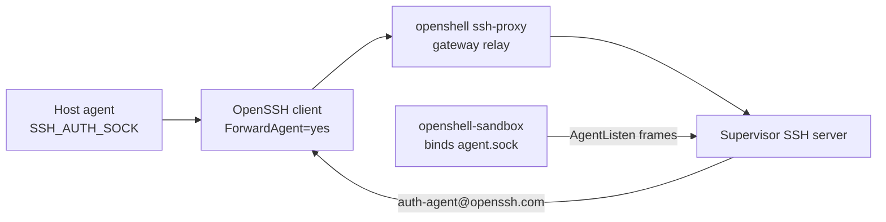

`--forward-agent` is opt-in. A sandbox with a live agent can list keys, sign, and push as the host user. A security-key certificate still asks for a tap on the host.

The host agent socket stays on your machine. Create overwrites `SSH_AUTH_SOCK` with a pinned path inside the sandbox. Agent-protocol bytes ride the same authenticated SSH session that `sandbox connect` uses. Docker, Podman, MicroVM, and Kubernetes all use that path.

## Path

The forward is one SSH session. Each accept on the sandbox socket is bridged back to that session.



1. Your SSH agent is already running. Create and connect check that `SSH_AUTH_SOCK` is set and the path exists.
2. The CLI opens an SSH session with `ForwardAgent=yes` and `IdentityAgent=SSH_AUTH_SOCK`. `IdentityAgent` is that token, not the raw path. Some agent socket paths contain spaces, and OpenSSH parses `-o` values as `ssh_config` lines.
3. `ProxyCommand` is `openshell ssh-proxy`. That is the same authenticated gateway relay `sandbox connect` uses. The client does not dial the sandbox pod, the Docker bridge, or a published Service.
4. The supervisor SSH server receives `auth-agent-req@openssh.com`. The first request on that server asks the workload to bind the socket (`Request::AgentListen` on the boundary channel).
5. `openshell-sandbox`, inside the workload mount namespace, binds `/tmp/openshell-ssh-agent/agent.sock` and multiplexes each accept back to the supervisor. The supervisor and the workload do not share a mount namespace, so the supervisor binds the SSH server socket and the workload binds the agent socket.
6. For each accept, the supervisor opens `auth-agent@openssh.com` toward the client. OpenSSH on your machine talks to the host agent. The private key stays there.

The mux frame is 9 bytes plus a payload: kind, connection id, length. Kinds are open, data, and close. Payloads are capped at 256 KiB.

The CLI sets `ForwardAgent=no` on every other SSH command, including exec, port forwards, and the readiness probe. A `ForwardAgent yes` line in `~/.ssh/config` does not override that.

## Kubernetes

On Kubernetes the command is the same. You do not need a route to the pod network, and the cluster does not publish an SSH Service for the shell.

`openshell sandbox connect` runs OpenSSH with `ProxyCommand` set to `openshell ssh-proxy`. The proxy asks the gateway for a session. The supervisor Pod already holds an authenticated channel to the gateway, which it opened outbound when the sandbox started. When you connect, the gateway asks that supervisor to open another stream on the same HTTP/2 connection. The supervisor splices those bytes into the SSH server listening on `/run/openshell/ssh.sock` inside the supervisor Pod.

The workload is a different Pod. It does not run an SSH server. `openshell-sandbox` in the workload binds `/tmp/openshell-ssh-agent/agent.sock` when the supervisor sends `AgentListen` over the sandbox boundary. That boundary is the authenticated channel the supervisor already uses for exec and network mediation. A `NetworkPolicy` admits supervisor traffic to the workload boundary Service and denies other workload-initiated egress.

Accepts on the agent socket travel back over that boundary, then over the gateway relay, then to the SSH client on your machine. The cluster never sees the host agent socket, and nothing in the cluster listens for agent protocol on a Service or a host port.

Docker, Podman, and MicroVM use the same relay and the same `AgentListen` request. The difference on Kubernetes is that the supervisor and the workload are separate Pods, so the agent socket cannot be a shared mount.

## Why the keepalive is a session

OpenSSH sends `auth-agent-req@openssh.com` on a session channel. `ssh -N` has no session channel, so it never forwards the agent, even with `ForwardAgent=yes`. Port forwards use `-N` and force `ForwardAgent=no`.

The background keepalive is a real session:

```text
ssh -f -T -o RequestTTY=no sandbox sleep infinity
```

with `ForwardAgent=yes`. The CLI records its PID under the forwards directory as `{workspace}/{name}-ssh-agent.pid`. `sandbox connect --forward-agent` starts that keepalive, then attaches an interactive session that also sets `ForwardAgent=yes`.

With `OPENSHELL_SSH_LOG_LEVEL=DEBUG`, the client prints `Requesting authentication agent forwarding.`

## Gates

Three checks have to pass. Any one of them failing leaves the sandbox without a usable agent.

### Host socket

`SSH_AUTH_SOCK` must be set and the path must exist before you create or connect with `--forward-agent`. An empty or missing socket fails before the sandbox is created.

### Pinned environment

Create injects `SSH_AUTH_SOCK=/tmp/openshell-ssh-agent/agent.sock` into the sandbox user environment. That overwrite keeps a host socket path out of the pod. The workload accepts `AgentListen` only when that exact value is present. A later `connect --forward-agent` cannot turn the gate on. Recreate a sandbox that was created without the flag.

### One listener

`openshell-sandbox` accepts a single `AgentListen` for the life of that process. A second request while that task is still running is rejected (`agent listener is already running`). The supervisor remembers that it already opened a listener for the current SSH server instance, and treats a repeat request on that same server as success without rebinding. A new client session is a new server instance, so it asks the workload to bind again.

`ssh_forward_agent` is a registered gateway setting and defaults to false. The forwarding path does not read it. The flag and the pinned environment are the gates.

The CLI and the supervisor have to include this support together. A supervisor that ignores `auth-agent-req@openssh.com` will accept the SSH session and never bind the agent socket. The workload binary has to include `AgentListen`.

## Socket location

The socket has to live on a writable path. Home is often read-only under Landlock, and a bind under `~/.ssh` fails with `Permission denied` because `bind` needs write.

The socket is `/tmp/openshell-ssh-agent/agent.sock`, mode `0600`, under a `0755` directory. `/tmp` is Landlock `read_write` in the default policy. Later processes see the path through `SSH_AUTH_SOCK`, so they look the agent up at use time rather than at process start.

The CLI's readiness check is `test -S` on that path, with a 10 second budget. It does not run `ssh-add`.

## Git signing

`--forward-agent` installs a sandbox git config and does not copy `user.signingKey` or any private key. Certificates stay in the host agent.

Create copies `user.name` and `user.email` from the host git config walk (local, then global, then system). When the host signs with SSH, the sandbox config sets `gpg.format=ssh`, copies `commit.gpgsign` and `tag.gpgsign` when the host has them, and sets `gpg.ssh.defaultKeyCommand=ssh-add -L`. If the host has an allowed signers file, it is copied to `/tmp/openshell-git/allowed_signers`. The host path is not used inside the sandbox, because that path is not present there.

`GIT_CONFIG_GLOBAL=/tmp/openshell-git/config` and `GIT_CONFIG_NOSYSTEM=1` point git at that file. Home is often read-only, so `~/.gitconfig` is not a writable place for it.

## GitHub SSH is a separate connection

The agent socket answers agent-protocol requests: list keys, sign a challenge. `git fetch git@github.com:...` still opens TCP to `github.com:22`. The supervisor mediates that connection the same way it mediates any other outbound TCP. Policy has to allow the binary that connects, usually `/usr/bin/ssh`. On Kubernetes that TCP leaves through the supervisor, not through a route from the workload Pod.

## Reconnect

The tunnel lives as long as the background SSH session does. A laptop sleep or a dropped session ends it. Bring it back with:

```shell
openshell sandbox connect NAME --forward-agent
```

A dropped session can leave the workload listener running. The socket path may still exist. `test -S` then succeeds, the CLI reports the forward as up, and `ssh-add` fails because nothing is bridging accepts to a live client.

OpenSSH exits 0 when the server rejects the agent request. `ExitOnForwardFailure` covers port forwards, not agent forwarding. The CLI notices a missing socket. A leftover socket makes the 10 second wait return immediately, and the checkmark is a false success.

If the socket is present but `ssh-add` cannot talk to it, remove the socket and connect again. When the new forward prints this, the previous listener is still held in the workload process:

```text
SSH agent forwarding did not bind /tmp/openshell-ssh-agent/agent.sock within 10000ms
```

Stop and start the sandbox, with the same gateway and workspace. That restarts `openshell-sandbox`, clears the listener, and keeps the workspace volume. Connect again with `--forward-agent`.

If stop and start still time out, the sandbox was created without `--forward-agent`. The environment gate keeps rejecting `AgentListen`. Delete it and create it again with the flag.

## Commands

Confirm the host agent, then create and connect with the flag. Inside the sandbox, the pinned socket should list the same certificate.

On the host, the agent must already list a key:

```shell
ssh-add -l
openshell sandbox create --forward-agent --name signed -- claude
openshell sandbox connect signed --forward-agent
```

Inside the sandbox:

```shell
echo "$SSH_AUTH_SOCK"
ssh-add -l
git config --get gpg.format
```

`SSH_AUTH_SOCK` is `/tmp/openshell-ssh-agent/agent.sock`. `ssh-add -l` lists the same certificate as the host. `gpg.format` is `ssh`.

## Next steps

See [Manage sandboxes](/how-it-works/sandboxes/overview) for create, connect, stop, and start, and [Kubernetes setup](/kubernetes/setup) for the cluster runtime. [Network rules](/how-it-works/policies/network-rules) are where you allow `github.com:22`. The agent socket carries signing requests only.
